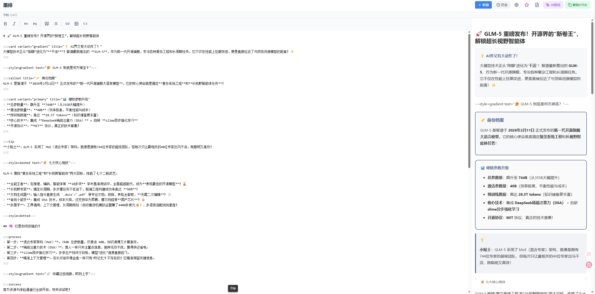

# 墨排 (Mopai)

- 说明：经测试，此种解析方式行不通，放弃此项目，导出格式微信公众号无法复原排版、显示界面如下


> 本地运行的浏览器端 Markdown 编辑器，一键生成微信兼容 HTML，支持 AI 智能优化排版


## ✨ 特性

### 核心功能
- **实时预览**：左侧 Markdown 编辑，右侧实时显示微信样式预览
- **一键导出**：生成带完整内联样式的微信兼容 HTML，直接粘贴到公众号后台
- **本地存储**：所有数据存储在浏览器 localStorage，无需服务器
- **自动保存**：停止输入 1 秒后自动保存，永不丢失内容
- **文章管理**：支持新建、切换、删除文章，最多保留 50 篇历史

### 编辑器功能
- 原生 textarea，支持 Tab 缩进（自动转 2 空格）
- 工具栏快捷插入：粗体、斜体、标题、引用、列表、链接、图片、代码块
- 光标自动定位到插入内容
- 字数统计实时显示

### 布局组件支持 🎨
支持丰富的布局组件语法，一键生成精美排版：

| 组件类型 | 语法示例 | 说明 |
|---------|---------|------|
| **信息框** | `:::tip 内容 :::` | 支持 tip/warning/success/error/note/quote |
| **卡片** | `:::card title="标题" 内容 :::` | 支持 default/primary/gradient/shadow/bordered/glass 变体 |
| **编号列表** | `:::numbered\n- 第一项\n- 第二项\n:::` | 自动编号圆圈，支持 Markdown 格式 |
| **流程步骤** | `:::process\n- 第一步\n- 第二步\n:::` | 垂直流程，带箭头连接 |
| **时间线** | `:::timeline\n- 2020年\n- 2021年\n:::` | 垂直时间线样式 |
| **信息提示** | `:::callout title="标题" 内容 :::` | 蓝色边框提示框 |
| **对比表格** | `:::comparison\n列A \| 列B\n值1 \| 值2\n:::` | 自动生成对比表格 |
| **分割线** | `---style=gradient---` | 支持 solid/dashed/dotted/gradient 样式 |
| **按钮** | `:::button url="#" text="点击" :::` | 支持多种样式变体 |
| **徽章** | `:::badge text="NEW" variant="filled" :::` | inline 徽章元素 |
| **进度条** | `:::progress percent="75" :::` | 可配置进度和颜色 |
| **间距** | `:::spacer height="40" :::` | 垂直间距占位 |

### 样式自定义
- **字体大小**：14-20px 可调
- **行距**：1.4-2.0 可调
- **主色调**：预设颜色 + 自定义选择器
- 实时预览样式效果

### AI 智能优化 🚀
- **多模型支持**：OpenAI、通义千问、文心一言、豆包、智谱 AI、自定义
- **风格模板**：简约、商务、活泼、学术、杂志五种内置风格
- **自定义模板**：完全可配置的自定义模板系统
  - 自定义系统提示词、布局指导、示例输出
  - 配置布局组件偏好（卡片样式、信息框、重点区域等）
  - 版本历史管理（最多10个版本）
  - 导入/导出模板（JSON格式）
  - 模板分享功能
- **流式输出**：实时显示 AI 生成内容
- **历史版本**：保存优化历史，支持一键回退
- **智能分段**：长文自动分段处理，保持上下文连贯

## 🛠️ 技术栈

| 技术 | 版本 | 用途 |
|------|------|------|
| Next.js | 14.2 | React 框架，App Router |
| TypeScript | 5.0 | 类型安全 |
| Tailwind CSS | 3.4 | 样式框架 |
| marked | 9.1 | Markdown 解析 |
| DOMPurify | 3.0 | HTML 净化 |
| lucide-react | 0.300 | 图标库 |

## 📁 项目结构

```
wechat/
├── app/                      # Next.js App Router
│   ├── api/
│   │   └── optimize/
│   │       └── route.ts      # AI 优化 API 接口
│   ├── templates/
│   │   └── page.tsx        # 模板管理页面
│   ├── layout.tsx            # 根布局
│   ├── page.tsx              # 主页面
│   └── globals.css           # 全局样式
│
├── components/               # React 组件
│   ├── Editor.tsx            # Markdown 编辑器
│   ├── Preview.tsx           # 微信样式预览
│   ├── Toolbar.tsx           # 顶部工具栏
│   ├── ArticleList.tsx       # 文章历史列表
│   ├── SettingPanel.tsx      # 样式设置面板
│   ├── AIConfigPanel.tsx     # AI 配置面板
│   ├── AIOptimizeButton.tsx  # AI 优化按钮
│   ├── TemplateSelector.tsx  # 风格模板选择器
│   ├── TemplateCard.tsx      # 模板卡片组件
│   ├── TemplateEditor.tsx    # 模板编辑器
│   ├── EnhancedTextarea.tsx  # 增强文本输入框
│   ├── TemplateVersionHistory.tsx # 版本历史弹窗
│   ├── TemplateShareModal.tsx     # 模板分享弹窗
│   ├── TemplateImportModal.tsx    # 模板导入弹窗
│   └── AIPreviewModal.tsx    # 优化结果预览弹窗
│
├── hooks/                    # 自定义 Hooks
│   ├── useArticle.ts         # 当前文章状态管理
│   ├── useArticles.ts        # 文章列表管理
│   ├── useSettings.ts        # 用户设置管理
│   ├── useAIConfig.ts        # AI 配置管理
│   ├── useAIOptimize.ts      # AI 优化状态管理
│   └── useTemplates.ts      # 模板状态管理
│
├── lib/                      # 工具库
│   ├── storage.ts            # localStorage 操作封装
│   ├── templateStorage.ts    # 模板存储操作
│   ├── markdown.ts           # Markdown 解析配置
│   ├── wechatStyle.ts        # 微信样式生成器
│   ├── prompts/             # AI 提示词模板
│   │   └── layoutPrompts.ts
│   └── utils.ts              # 工具函数
│
├── types/                    # TypeScript 类型定义
│   ├── index.ts              # 基础类型（Article, Settings 等）
│   └── ai.ts                 # AI 相关类型
│
├── .env.example              # 环境变量示例
├── package.json              # 项目配置
├── tsconfig.json             # TypeScript 配置
├── tailwind.config.ts        # Tailwind CSS 配置
└── next.config.js            # Next.js 配置
```

## 🚀 快速开始

### 安装依赖

```bash
npm install
```

### 启动开发服务器

```bash
npm run dev
```

访问 [http://localhost:3000](http://localhost:3000) 即可使用

### 构建生产版本

```bash
npm run build
npm start
```

## ⚙️ 配置说明

### AI 优化配置

AI 优化功能需要配置大模型 API。在应用中点击「AI优化」按钮，选择「配置」：

1. **选择服务商**：自动填充默认配置
2. **输入 API Key**：从对应平台获取
3. **配置 API 地址**：使用默认或自定义中转地址
4. **选择模型**：根据服务商选择可用模型
5. **测试连接**：验证配置是否正确

#### 支持的服务商

| 服务商 | 默认 API 地址 | 推荐模型 |
|--------|-------------|---------|
| OpenAI | `https://api.openai.com/v1` | `gpt-4o-mini` |
| 通义千问 | `https://dashscope.aliyuncs.com/compatible-mode/v1` | `qwen-plus` |
| 文心一言 | `https://aip.baidubce.com/rpc/2.0/ai_custom/v1/wenxinworkshop` | `ernie-bot-4` |
| 豆包 | `https://ark.cn-beijing.volces.com/api/v3` | `doubao-pro-32k` |
| 智谱AI | `https://open.bigmodel.cn/api/paas/v4` | `glm-4-flash` |

#### 环境变量（可选）

创建 `.env` 文件（可选，也可在界面配置）：

```bash
# 通义千问示例
QWEN_API_KEY=sk-xxxxx
QWEN_BASE_URL=https://dashscope.aliyuncs.com/compatible-mode/v1
AI_MODEL=qwen-plus
AI_TEMPERATURE=0.7
AI_MAX_TOKENS=8000
```

## 📖 使用指南

### 基础编辑

1. **新建文章**：点击「新建」按钮创建新文章
2. **编辑内容**：左侧编辑器输入 Markdown
3. **实时预览**：右侧实时显示微信样式
4. **插入语法**：使用工具栏快捷插入 Markdown 语法
5. **自动保存**：停止输入 1 秒后自动保存

### 样式调整

1. 点击「设置」按钮打开样式面板
2. 调整字体大小、行距、主色调
3. 实时预览调整效果
4. 调整会自动应用到导出的 HTML

### 导出 HTML

1. 点击「复制HTML」按钮
2. 使用 Ctrl+V 粘贴到公众号后台
3. 样式完整保留，无需二次编辑

### AI 优化

1. 点击「AI优化」按钮
2. 选择优化风格模板（简约/商务/活泼/学术/杂志）或自定义模板
3. AI 流式生成优化内容
4. 预览对比优化效果
5. 点击「应用优化」或选择历史版本

### 模板管理 🎨

点击工具栏的文件图标进入模板管理页面，或选择模板时点击「管理模板」链接：

**内置模板**
- 查看5种预设风格模板
- 点击「复制」创建基于内置模板的自定义版本

**创建自定义模板**
1. 点击「新建模板」
2. 填写基本信息（图标、名称、描述）
3. 配置提示词：
   - **系统提示词**：定义 AI 角色和风格
   - **布局指导**：指定使用的布局组件
   - **示例输出**：提供参考示例
4. 设置布局偏好（卡片样式、信息框、重点区域等）
5. 配置 AI 参数（可选）
6. 预览并保存

**模板操作**
- **编辑**：修改现有模板
- **复制**：快速创建模板副本
- **删除**：删除不需要的自定义模板
- **版本历史**：查看和恢复历史版本
- **导出**：导出单个或全部模板为 JSON
- **导入**：从 JSON 文件或剪贴板导入模板
- **分享**：复制模板 JSON 分享给他人

## 🏗️ 开发指南

### 添加新的优化风格

1. 在 `types/ai.ts` 中添加新的 `TemplateId` 类型
2. 在 `TEMPLATES` 中添加模板配置
3. 在 `app/api/optimize/route.ts` 的 `getOptimizePrompt` 函数中添加对应的 prompt 模板

### 添加新的大模型支持

1. 在 `types/ai.ts` 中添加新的 `AIProvider`
2. 在 `PROVIDER_CONFIGS` 中添加配置
3. 如需特殊处理，在 `app/api/optimize/route.ts` 中添加适配逻辑

### localStorage 数据结构

```typescript
// 文章数据
Key: "mopai_v1"
{
  "currentId": "1707654321000",
  "articles": [
    {
      "id": "1707654321000",
      "title": "文章标题",
      "content": "# 文章标题\n\n正文...",
      "createdAt": 1707654321000,
      "updatedAt": 1707654389000
    }
  ],
  "settings": {
    "fontSize": 16,
    "lineHeight": 1.75,
    "primaryColor": "#576b95"
  }
}

// AI 配置
Key: "mopai_ai_config"
{
  "enabled": true,
  "provider": "qwen",
  "apiKey": "sk-xxx",
  "baseUrl": "https://...",
  "model": "qwen-plus",
  "temperature": 0.7,
  "maxTokens": 8000
}

// 优化历史
Key: "mopai_ai_history_{articleId}"
[
  {
    "id": "xxx",
    "articleId": "xxx",
    "originalContent": "...",
    "optimizedContent": "...",
    "templateId": "simple",
    "createdAt": 1707654321000
  }
]

// 模板数据
Key: "mopai_templates"
{
  "custom": [
    {
      "id": "custom_1707654321000",
      "name": "科技风格",
      "description": "适合科技类内容的排版",
      "icon": "🚀",
      "systemPrompt": "你是一个专业的...",
      "layoutPrompt": "## 推荐组件...",
      "exampleOutput": "# 标题...",
      "features": ["卡片", "信息框"],
      "source": "custom",
      "createdAt": 1707654321000,
      "updatedAt": 1707654389000,
      "version": 1
    }
  ],
  "builtin": ["simple", "business", "lively", "academic", "magazine"]
}

// 模板版本历史
Key: "mopai_template_versions_{templateId}"
{
  "templateId": "custom_1707654321000",
  "versions": [
    {
      "id": "v_xxx",
      "templateId": "custom_1707654321000",
      "config": { /* 完整的模板配置 */ },
      "createdAt": 1707654321000,
      "changeDescription": "修改了系统提示词"
    }
  ]
}
```

### API 接口

#### POST /api/optimize

AI 优化接口，支持流式输出

**请求体：**
```json
{
  "content": "待优化的 Markdown 内容",
  "templateId": "simple",
  "config": {
    "provider": "qwen",
    "apiKey": "sk-xxx",
    "baseUrl": "https://...",
    "model": "qwen-plus",
    "temperature": 0.7,
    "maxTokens": 8000
  }
}
```

**响应：** text/event-stream 流式响应

#### PUT /api/optimize

测试 AI 连接

**请求体：**
```json
{
  "config": { /* AIConfig */ }
}
```

**响应：**
```json
{
  "success": true,
  "message": "连接成功",
  "reply": "AI 回复内容"
}
```

## 🔧 常见问题

### Q: AI 优化连接失败怎么办？
A: 检查以下几点：
1. API Key 是否正确
2. API 地址是否可访问（注意中转地址）
3. 模型名称是否正确
4. 是否有足够的配额
5. 查看控制台错误信息获取详细提示

### Q: 导出的 HTML 样式不对？
A: 确保：
1. 使用「复制HTML」按钮而非手动复制
2. 公众号后台使用「源码模式」粘贴
3. 检查是否安装了可能干扰的浏览器插件

### Q: 数据会丢失吗？
A: 所有数据存储在浏览器 localStorage 中：
- 正常关闭浏览器不会丢失
- 清除浏览器数据会丢失
- 建议定期导出重要文章备份

### Q: 支持多设备同步吗？
A: 目前不支持，所有数据存储在本地。如需多设备使用，建议：
1. 使用文章列表导出功能
2. 或使用浏览器同步功能

## 📝 待办事项

- [ ] 支持导出 Markdown 文件
- [ ] 支持导入本地 Markdown 文件
- [ ] 添加图片上传功能（图床集成）
- [ ] 支持云存储同步
- [ ] 添加更多内置优化风格模板
- [x] 支持自定义优化 prompt ✅
- [ ] 添加文章统计功能（阅读时间估算等）
- [ ] 支持快捷键操作
- [ ] 添加暗黑模式
- [ ] 支持多语言

## 📄 许可证

MIT License

## 🤝 贡献

欢迎提交 Issue 和 Pull Request！

## 📮 联系方式

如有问题或建议，请提交 [Issue](https://github.com/xxx/mopai/issues)

---

**墨排** - 让公众号排版更简单
